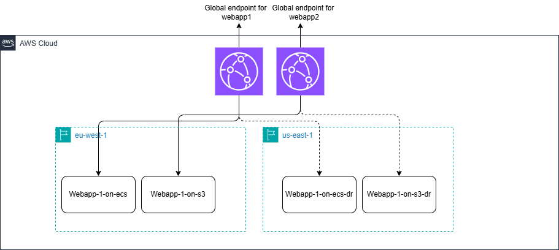

# Interview Website

## Description

2 webapps hosted in 2 differents ways. 
- Webapp1 is hosted in a container and deployed on an ECS infrastructure. 
  - It is the most expensive of the 2 solutions and most complexe to deploy (especially if we deploy databases)
  - On the otherhand, it offers flexibility on the application -> We can adapt this code and Dockerfile to create anykind of webapp : python, go, react, html etc.
- Webapp2 is hosted in a bucket S3. 
  - This solution is easy to deploy as the static site is pushed in an S3 as static file. 
  - On the otherhand, S3 only supports static files as they are fetched by the client web browser.




The 2 webapps are pushed and deployed on 2 regions : eu-west-1 and us-east-1 as DR. 

Each webapp has a cloudfront distribution in front that has a failover on the secondary region. To test, destroy the primary region and validate the website is still valide.

We could add database on RDS in the scenario with container and ECS but it has not be done here. 


For more info on webapp1 : Check its [README.me](./registry/app/webapp-on-ecs-asg/README.md)

For more info on webapp2 : Check its [README.me](./registry/app/webapp-on-s3-cdn/README.md)

## Develop

To contribute to this project, create a codespace here, or in your VSCode, with all the tools needed to develop (strongly recommanded).
Or ```git clone``` the repository in your own environment. Here are the tools and VSCode extensions added for a complete setup :

- pre-commit
  - Install it with the doc [here](https://pre-commit.com/#install)
  - Run ```pre-commit install``` in the target directory

- VSCode extensions : 
  - [markdown All in One](https://marketplace.visualstudio.com/items?itemName=yzhang.markdown-all-in-one)
  - [Hashicorp HCL](https://marketplace.visualstudio.com/items?itemName=HashiCorp.HCL)
  - [Drawio](https://marketplace.visualstudio.com/items?itemName=hediet.vscode-drawio)


<!-- BEGIN_TF_DOCS -->
## Requirements

| Name | Version |
|------|---------|
| <a name="requirement_terraform"></a> [terraform](#requirement\_terraform) | >=1.12.2 |
| <a name="requirement_aws"></a> [aws](#requirement\_aws) | 6.7.0 |
| <a name="requirement_docker"></a> [docker](#requirement\_docker) | >= 3.6.2 |
| <a name="requirement_null"></a> [null](#requirement\_null) | >= 3.2.4 |

## Providers

No providers.

## Modules

| Name | Source | Version |
|------|--------|---------|
| <a name="module_interview_webapp1"></a> [interview\_webapp1](#module\_interview\_webapp1) | ./registry/app/webapp-on-ecs-asg | n/a |

## Resources

No resources.

## Inputs

| Name | Description | Type | Default | Required |
|------|-------------|------|---------|:--------:|
| <a name="input_primary_region"></a> [primary\_region](#input\_primary\_region) | AWS primary region to use. | `string` | n/a | yes |
| <a name="input_profile"></a> [profile](#input\_profile) | Profile used for authentication to AWS. -- Can be changed or ignored if using a CICD or default profile. | `string` | `"sandbox"` | no |
| <a name="input_secondary_region"></a> [secondary\_region](#input\_secondary\_region) | AWS secondary region to use. | `string` | n/a | yes |

## Outputs

| Name | Description |
|------|-------------|
| <a name="output_interview_webapp1_url"></a> [interview\_webapp1\_url](#output\_interview\_webapp1\_url) | n/a |
<!-- END_TF_DOCS -->
<!-- BEGINNING OF PRE-COMMIT-TERRAFORM DOCS HOOK -->
README.md updated successfully
<!-- END OF PRE-COMMIT-TERRAFORM DOCS HOOK -->
