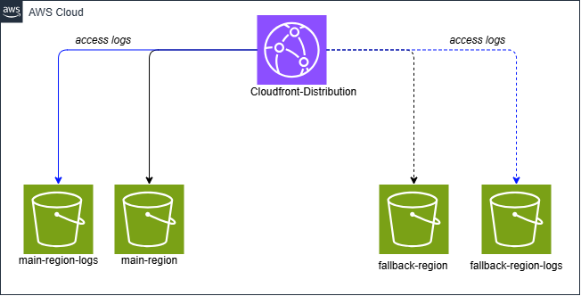

# webapp 2

## Description 

Deploy a new webapp on S3.

## Requirement

To manage this module you need 
  - [terraform](https://www.terraform.io)
  - [terraform-docs](https://github.com/terraform-docs/terraform-docs)

<!-- BEGIN_TF_DOCS -->
## Requirements

| Name | Version |
|------|---------|
|  [aws](#requirement\_aws) | >= 6.7.0 |
|  [null](#requirement\_null) | >= 3.2.4 |

## Providers

| Name | Version |
|------|---------|
|  [aws](#provider\_aws) | >= 6.7.0 |
|  [null](#provider\_null) | >= 3.2.4 |

## Modules

| Name | Source | Version |
|------|--------|---------|
|  [cloudfront](#module\_cloudfront) | ../../components/network/cloudfront-s3 | n/a |
|  [s3\_buckets](#module\_s3\_buckets) | ./buckets-and-push | n/a |
|  [s3\_buckets\_dr](#module\_s3\_buckets\_dr) | ./buckets-and-push | n/a |
|  [s3\_replication](#module\_s3\_replication) | ../../components/storage/s3-replication | n/a |

## Resources

| Name | Type |
|------|------|
| [null_resource.build_project](https://registry.terraform.io/providers/hashicorp/null/latest/docs/resources/resource) | resource |
| [null_resource.synchro_project](https://registry.terraform.io/providers/hashicorp/null/latest/docs/resources/resource) | resource |
| [null_resource.synchro_project_dr](https://registry.terraform.io/providers/hashicorp/null/latest/docs/resources/resource) | resource |
| [aws_caller_identity.current](https://registry.terraform.io/providers/hashicorp/aws/latest/docs/data-sources/caller_identity) | data source |
| [aws_region.current](https://registry.terraform.io/providers/hashicorp/aws/latest/docs/data-sources/region) | data source |

## Inputs

| Name | Description | Type | Default | Required |
|------|-------------|------|---------|:--------:|
|  [deploy\_dr](#input\_deploy\_dr) | Deploy DR in secondary region if needed. | `bool` | `false` | no |
|  [profile](#input\_profile) | Profile used for authentication to AWS. -- Can be changed or ignored if using a CICD or default profile. | `string` | n/a | yes |
|  [secondary\_region](#input\_secondary\_region) | Secondary region to deploy the DR into. | `string` | `"eu-central-1"` | no |
|  [webapp\_name](#input\_webapp\_name) | Webapp name to deploy. Will be used for all sub-resources names. | `string` | n/a | yes |
|  [webapp\_src\_code](#input\_webapp\_src\_code) | Complete path to build code and publish it on ECS cluster. | `string` | n/a | yes |

## Outputs

| Name | Description |
|------|-------------|
|  [app\_url](#output\_app\_url) | n/a |
<!-- END_TF_DOCS -->