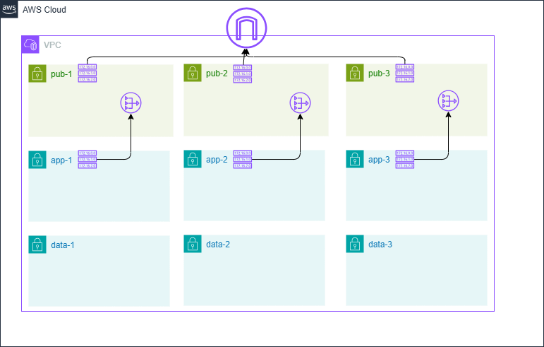

# vpc-and-subnets-single-nat

## Description 

Deploy a new webapp.

## Requirement

To manage this module you need 
  - [terraform](https://www.terraform.io)
  - [terraform-docs](https://github.com/terraform-docs/terraform-docs)

<!-- BEGIN_TF_DOCS -->
## Requirements

| Name | Version |
|------|---------|
|  [aws](#requirement\_aws) | >= 6.7.0 |

## Providers

| Name | Version |
|------|---------|
|  [aws](#provider\_aws) | >= 6.7.0 |

## Modules

| Name | Source | Version |
|------|--------|---------|
|  [network\_foundations](#module\_network\_foundations) | ../../network/vpc-subnets-multi-az | n/a |

## Resources

| Name | Type |
|------|------|
| [aws_region.current](https://registry.terraform.io/providers/hashicorp/aws/latest/docs/data-sources/region) | data source |

## Inputs

| Name | Description | Type | Default | Required |
|------|-------------|------|---------|:--------:|
|  [app\_subnets](#input\_app\_subnets) | The app subnets CIDRs | `list(string)` | <pre>[   "10.0.1.0/24",   "10.0.2.0/24",   "10.0.3.0/24" ]</pre> | no |
|  [data\_subnets](#input\_data\_subnets) | The data subnets CIDRs | `list(string)` | <pre>[   "10.0.21.0/24",   "10.0.22.0/24",   "10.0.23.0/24" ]</pre> | no |
|  [public\_subnets](#input\_public\_subnets) | The public subnets CIDRs | `list(string)` | <pre>[   "10.0.11.0/24",   "10.0.12.0/24",   "10.0.13.0/24" ]</pre> | no |
|  [vpc\_cidr](#input\_vpc\_cidr) | The VPC CIDR | `string` | `"10.0.0.0/22"` | no |
|  [webapp\_name](#input\_webapp\_name) | Webapp name to deploy. Will be used for all sub-resources names. | `string` | n/a | yes |
|  [wepapp\_tags](#input\_wepapp\_tags) | Web app dedicated tags to add to any resources. | `map(string)` | `{}` | no |

## Outputs

No outputs.
<!-- END_TF_DOCS -->