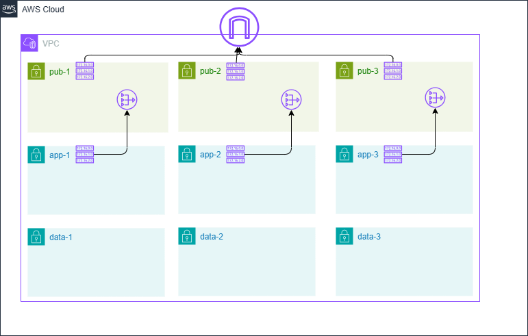

# vpc-and-subnets-single-nat

## Description 

Deploy a new VPC and subnets, with one NAT if public subnets are needed.

## Requirement

To manage this module you need 
  - [terraform](https://www.terraform.io)
  - [terraform-docs](https://github.com/terraform-docs/terraform-docs)

<!-- BEGIN_TF_DOCS -->
## Requirements

| Name | Version |
|------|---------|
|  [aws](#requirement\_aws) | >= 6.7.0 |

## Providers

| Name | Version |
|------|---------|
|  [aws](#provider\_aws) | >= 6.7.0 |

## Modules

No modules.

## Resources

| Name | Type |
|------|------|
| [aws_eip.eip](https://registry.terraform.io/providers/hashicorp/aws/latest/docs/resources/eip) | resource |
| [aws_internet_gateway.igw](https://registry.terraform.io/providers/hashicorp/aws/latest/docs/resources/internet_gateway) | resource |
| [aws_nat_gateway.nat](https://registry.terraform.io/providers/hashicorp/aws/latest/docs/resources/nat_gateway) | resource |
| [aws_route_table.app_rtb](https://registry.terraform.io/providers/hashicorp/aws/latest/docs/resources/route_table) | resource |
| [aws_route_table.data_rtb](https://registry.terraform.io/providers/hashicorp/aws/latest/docs/resources/route_table) | resource |
| [aws_route_table.publics_rtb](https://registry.terraform.io/providers/hashicorp/aws/latest/docs/resources/route_table) | resource |
| [aws_route_table_association.app_rtb](https://registry.terraform.io/providers/hashicorp/aws/latest/docs/resources/route_table_association) | resource |
| [aws_route_table_association.data_rtb](https://registry.terraform.io/providers/hashicorp/aws/latest/docs/resources/route_table_association) | resource |
| [aws_route_table_association.public_rtb](https://registry.terraform.io/providers/hashicorp/aws/latest/docs/resources/route_table_association) | resource |
| [aws_subnet.apps](https://registry.terraform.io/providers/hashicorp/aws/latest/docs/resources/subnet) | resource |
| [aws_subnet.datas](https://registry.terraform.io/providers/hashicorp/aws/latest/docs/resources/subnet) | resource |
| [aws_subnet.publics](https://registry.terraform.io/providers/hashicorp/aws/latest/docs/resources/subnet) | resource |
| [aws_vpc.main](https://registry.terraform.io/providers/hashicorp/aws/latest/docs/resources/vpc) | resource |
| [aws_availability_zones.azs](https://registry.terraform.io/providers/hashicorp/aws/latest/docs/data-sources/availability_zones) | data source |
| [aws_region.current](https://registry.terraform.io/providers/hashicorp/aws/latest/docs/data-sources/region) | data source |

## Inputs

| Name | Description | Type | Default | Required |
|------|-------------|------|---------|:--------:|
|  [app\_subnets](#input\_app\_subnets) | The app subnets CIDRs | `list(string)` | n/a | yes |
|  [data\_subnets](#input\_data\_subnets) | The data subnets CIDRs | `list(string)` | n/a | yes |
|  [extra\_tags](#input\_extra\_tags) | Extra tags to add to any resources. | `map(string)` | `{}` | no |
|  [network\_name](#input\_network\_name) | The network name | `string` | n/a | yes |
|  [public\_subnets](#input\_public\_subnets) | The public subnets CIDRs | `list(string)` | n/a | yes |
|  [vpc\_cidr](#input\_vpc\_cidr) | The VPC CIDR | `string` | n/a | yes |

## Outputs

| Name | Description |
|------|-------------|
|  [apps\_subnets\_ids](#output\_apps\_subnets\_ids) | n/a |
|  [datas\_subnets\_ids](#output\_datas\_subnets\_ids) | n/a |
|  [nat\_public\_ips](#output\_nat\_public\_ips) | n/a |
|  [publics\_subnets\_ids](#output\_publics\_subnets\_ids) | n/a |
|  [vpc\_id](#output\_vpc\_id) | n/a |
<!-- END_TF_DOCS -->